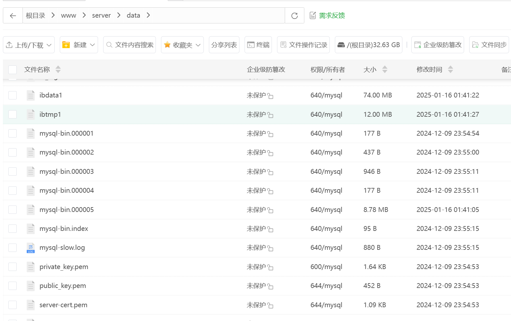
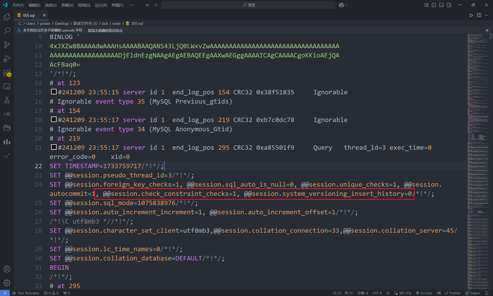

# 待写

事故原因：
由于脚本打卡失败无法获得此次打卡人的姓名，数据库存打卡失败real_name为"-"，这个本来是可以确定姓名的，需要去数据库查一下users表中数据（手动录入的real_name）

现在想写一个数据清洗的功能将数据库中real_name中为"-"清晰为真正姓名。

解决时间：一个半小时

第一次遇到这种事情，开始比较紧张直接让数据库给删除了，导致后面只能用binlog全量恢复，其实可以用binlog的增量恢复来修复故障

```java
@Autowired
private UserService userService;

@Autowired
private ShiXiLogService shiXiLogService;

@Test
public void test10() {
    List<User> list = userService.list();
    list.stream()
            .filter(item -> Objects.nonNull(item.getRealName()))
            .forEach(user -> {
                LambdaUpdateWrapper<ShiXiLog> updateWrapper = new LambdaUpdateWrapper<>();
                updateWrapper
                        .set(ShiXiLog::getRealName, user.getRealName())
                        .eq(ShiXiLog::getUserId, user.getId())
                        .eq(ShiXiLog::getRealName, "-");
                shiXiLogService.update(updateWrapper);
            });
}
```

无意中看到很多日志的时间是"2025-01-15 23:17:07"，排查发现是logs表中create_time字段更新是设置了默认值CURRENT_TIMESTAMP。导致更新的数据的create_time全部更为为当前时间，这已经脱离了之前的逻辑，之前的逻辑仅仅是修改real_name。


1.找到备份文件

我采用的是binlog文件，还好宝塔会自动保存binlog文件

找到binlog日志，将其解析为sql文件


```shell
cd /www/server/data
mysqlbinlog --no-defaults  mysql-bin.000005 > 005.sql
```
2.恢复binlog全量数据

```shell
mysql -u root -p < 005.sql
```

3.恢复找数据期间的增量数据

同学在我恢复数据期间在调试代码，期间加入了一些增量数据

我处理方式是和同学沟通待不调试后先找到这些增量数据进行备份成sql，然后在binlog全量数据恢复后，将这些增量数据直接插入表中

当然，我是在不调试后开始的增量数据备份，全量数据恢复，然后是增量数据恢复


遇到的问题

变量问题将sql文件中的'check_constraint_checks'，'system_versioning_insert_history'删除掉

ERROR 1193 (HY000) at line 24: Unknown system variable 'check_constraint_checks'

ERROR 1193 (HY000) at line 24: Unknown system variable 'system_versioning_insert_history'



数据库已经存在，因为binlog中有创建数据库的语句

ERROR 1007 (HY000) at line 60: Can't create database 'shixi'; database exists


用户已经存在，因为binlog中有创建用户的语句，我是用的宝塔创建的数据库，创建了一个shixi的用户

ERROR 1396 (HY000) at line 68: Operation CREATE USER failed for 'shixi'@'localhost'

ERROR 1396 (HY000) at line 84: Operation CREATE USER failed for 'shixi'@'%'

